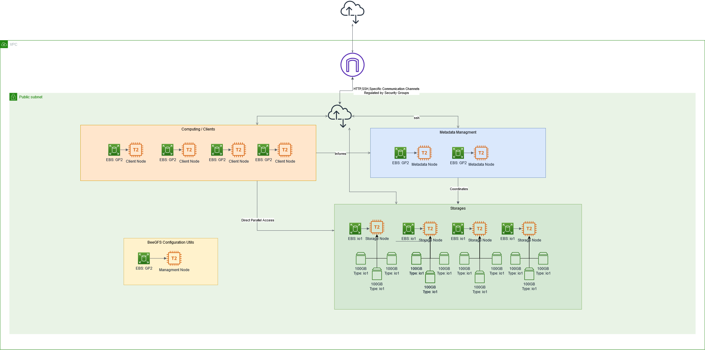

# Pointcloud Tiler + BeeGFS Cloud Deployment

## AWS

### Requirements

* Packer
* Terraform
* Ansible
* Python
* aws CLI

### Install Packer Ansible Terraform

Packer:

[Installation Guide Packer](https://learn.hashicorp.com/tutorials/packer/getting-started-install#precompiled-binaries)

Terraform:

[Installation Guide Terraform](https://learn.hashicorp.com/tutorials/terraform/install-cli)

Ansible:
```
python -m -venv venv
source venv/bin/activate
pip install ansible
```

Afterwards initialize Ansible roles via `ansible-galaxy install -r requirements.yml` inside the Ansible folder or via make command `AWS-ansible-install`


### Setup AWS CLI
To configure your aws cli insert two profiles and a credential entry to aws configs in ~/.aws

create 2 new roles in ~/.aws/config 
```
[profile xyz]

[profile produser]
role_arn = <role>
source_profile = default
region = us-west-2
output = json
```

create 1 credential entry in ~/.aws/credentials

```
[xyz]
aws_access_key_id =  <insert secret access key id>
aws_secret_access_key =  <insert secret access key>
```
### Build the AWS AMI

Run packer with a Makefile command

```
make AWS-packer-build
``` 

### Init Terraform

Run terraform plan to validate the script and see the changes terraform intends to perform

```
make AWS-terraform-init
``` 

### Apply Terraform

Run terraform apply to setup the infrastructure with AWS, this command is going to prompt you. Type ```yes``` to actually deploy the VMs
```
make AWS-terraform-apply
```

### Using preconfigured SSH via Hostfile template

To use the generated ssh-config file you have to either 
1) use the connect make command 
2) move the config file to the specific location ```~/.ssh/config```


or use the following command to move the file and **overwrite** the old ssh-config:

```
move-ssh-config-to-ssh-directory
```

### Provision the running ec2 instance

```
make AWS-provisioning
```

for a more verbose provisioning use:

```
make AWS-provisioning-verbose
```

### Architecture



### Benchmarking


#### point-read-perf
tool: https://geocode.igd.fraunhofer.de/pointclouds/point-read-perf

##### First Example: Local Filesystem; 259.504 Points, 796.8 KB

```
 INFO  pointreadperf::bench > Benchmark "full_read":     259504 items,     166.37ms,    1559815 items/s     (mean of 5 measurements)
 INFO  pointreadperf::bench > Benchmark "strided"(  4096):         63 items,     795.68ms,         79 items/s
 INFO  pointreadperf::bench > Benchmark "strided"(  8192):         31 items,     408.06ms,         76 items/s
 INFO  pointreadperf::bench > Benchmark "strided"( 16384):         15 items,     211.90ms,         71 items/s
 INFO  pointreadperf::bench > Benchmark "strided"( 32768):          7 items,      93.09ms,         75 items/s     (mean of 5 measurements)
 INFO  pointreadperf::bench > Benchmark "strided"( 65536):          3 items,      25.15ms,        119 items/s     (mean of 5 measurements)
 INFO  pointreadperf::bench > Benchmark "strided"(131072):          1 items,       1.55ms,        646 items/s     (mean of 5 measurements)
 INFO  pointreadperf::bench > Benchmark "blocks"(     2,  2048):     130480 items,     899.21ms,     145105 items/s
 INFO  pointreadperf::bench > Benchmark "blocks"(     2,  4096):     131072 items,     505.88ms,     259099 items/s
 INFO  pointreadperf::bench > Benchmark "blocks"(     2,  8192):     131072 items,     327.26ms,     400509 items/s
 INFO  pointreadperf::bench > Benchmark "blocks"(     2, 16384):     131072 items,     196.16ms,     668177 items/s     (mean of 5 measurements)
 INFO  pointreadperf::bench > Benchmark "blocks"(     2, 32768):     131072 items,     133.76ms,     979873 items/s     (mean of 5 measurements)
 INFO  pointreadperf::bench > Benchmark "blocks"(     2, 65536):     131072 items,     103.29ms,    1268955 items/s     (mean of 5 measurements)
 INFO  pointreadperf::bench > Benchmark "blocks"(     2,131072):     131072 items,      85.22ms,    1538004 items/s     (mean of 5 measurements)
 INFO  pointreadperf::bench > Benchmark "blocks"(     2,262144):     259504 items,     171.80ms,    1510542 items/s     (mean of 5 measurements)
 INFO  pointreadperf::bench > Benchmark "blocks"(     2,524288):     259504 items,     171.42ms,    1513890 items/s     (mean of 5 measurements)
 INFO  pointreadperf::bench > Benchmark "blocks"(     2,1048576):     259504 items,     172.35ms,    1505637 items/s     (mean of 5 measurements)
 INFO  pointreadperf::bench > Benchmark "begin_of_chunk"(     1):          6 items,       8.58ms,        699 items/s     (mean of 5 measurements)
 INFO  pointreadperf::bench > Benchmark "begin_of_chunk"(     2):         12 items,       8.65ms,       1388 items/s     (mean of 5 measurements)
 INFO  pointreadperf::bench > Benchmark "begin_of_chunk"(     4):         24 items,       8.55ms,       2808 items/s     (mean of 5 measurements)
 INFO  pointreadperf::bench > Benchmark "begin_of_chunk"(     8):         48 items,       8.62ms,       5570 items/s     (mean of 5 measurements)
 INFO  pointreadperf::bench > Benchmark "begin_of_chunk"(    16):         96 items,       8.91ms,      10776 items/s     (mean of 5 measurements)
 INFO  pointreadperf::bench > Benchmark "begin_of_chunk"(    32):        192 items,       8.79ms,      21845 items/s     (mean of 5 measurements)
 INFO  pointreadperf::bench > Benchmark "begin_of_chunk"(    64):        384 items,       8.65ms,      44395 items/s     (mean of 5 measurements)
 INFO  pointreadperf::bench > Benchmark "begin_of_chunk"(   128):        768 items,       9.01ms,      85282 items/s     (mean of 5 measurements)
 INFO  pointreadperf::bench > Benchmark "begin_of_chunk"(   256):       1536 items,       9.62ms,     159645 items/s     (mean of 5 measurements)
 INFO  pointreadperf::bench > Benchmark "begin_of_chunk"(   512):       3072 items,      10.66ms,     288059 items/s     (mean of 5 measurements)
 INFO  pointreadperf::bench > Benchmark "begin_of_chunk"(  1024):       6144 items,      13.39ms,     458755 items/s     (mean of 5 measurements)
 INFO  pointreadperf::bench > Benchmark "begin_of_chunk"(  2048):      12288 items,      17.33ms,     709124 items/s     (mean of 5 measurements)
 INFO  pointreadperf::bench > Benchmark "begin_of_chunk"(  4096):      24576 items,      29.36ms,     837086 items/s     (mean of 5 measurements)
 INFO  pointreadperf::bench > Benchmark "begin_of_chunk"(  8192):      49152 items,      44.19ms,    1112198 items/s     (mean of 5 measurements)
 INFO  pointreadperf::bench > Benchmark "begin_of_chunk"( 16384):      91424 items,      66.54ms,    1373890 items/s     (mean of 5 measurements)
 INFO  pointreadperf::bench > Benchmark "begin_of_chunk"( 32768):     173344 items,     114.02ms,    1520296 items/s     (mean of 5 measurements)
 INFO  pointreadperf::bench > Benchmark "begin_of_chunk"( 50000):     259504 items,     165.25ms,    1570341 items/s     (mean of 5 measurements)
 INFO  pointreadperf::bench > Benchmark "full_chunks"(     1):     259504 items,     164.49ms,    1577675 items/s     (mean of 5 measurements)
 INFO  pointreadperf::bench > Benchmark "full_chunks"(     2):     150000 items,      96.09ms,    1561030 items/s     (mean of 5 measurements)
 INFO  pointreadperf::bench > Benchmark "full_chunks"(     4):     100000 items,      64.85ms,    1541981 items/s     (mean of 5 measurements)
 INFO  pointreadperf::bench > Benchmark "full_chunks"(     8):      50000 items,      31.69ms,    1577598 items/s     (mean of 5 measurements)
 INFO  pointreadperf::bench > Benchmark "full_chunks"(    16):      50000 items,      31.92ms,    1566444 items/s     (mean of 5 measurements)
 INFO  pointreadperf::bench > Benchmark "full_chunks"(    32):      50000 items,      31.88ms,    1568576 items/s     (mean of 5 measurements)
 INFO  pointreadperf::bench > Benchmark "full_chunks"(    64):      50000 items,      31.80ms,    1572446 items/s     (mean of 5 measurements)
 INFO  pointreadperf::bench > Benchmark "full_chunks"(   128):      50000 items,      32.28ms,    1548974 items/s     (mean of 5 measurements)
 INFO  pointreadperf::bench > Benchmark "full_chunks"(   256):      50000 items,      31.79ms,    1572947 items/s     (mean of 5 measurements)
 ```

##### Second Example: Local Filesystem, 17.457.650 Points, 158 MB

```
 INFO  pointreadperf::bench > Benchmark "full_read":   17457650 items,   17266.07ms,    1011096 items/s     (mean of 5 measurements)
 INFO  pointreadperf::bench > Benchmark "strided"(  4096):       4262 items,   88421.99ms,         48 items/s
 INFO  pointreadperf::bench > Benchmark "strided"(  8192):       2131 items,   44612.66ms,         48 items/s
 INFO  pointreadperf::bench > Benchmark "strided"( 16384):       1065 items,   22598.68ms,         47 items/s
 INFO  pointreadperf::bench > Benchmark "strided"( 32768):        532 items,   11295.02ms,         47 items/s     (mean of 5 measurements)
 INFO  pointreadperf::bench > Benchmark "strided"( 65536):        266 items,    5792.20ms,         46 items/s     (mean of 5 measurements)
 INFO  pointreadperf::bench > Benchmark "strided"(131072):        133 items,    2891.82ms,         46 items/s     (mean of 5 measurements)
 INFO  pointreadperf::bench > Benchmark "blocks"(     2,  2048):    8729074 items,   96805.74ms,      90171 items/s
 INFO  pointreadperf::bench > Benchmark "blocks"(     2,  4096):    8729074 items,   52733.43ms,     165532 items/s
 INFO  pointreadperf::bench > Benchmark "blocks"(     2,  8192):    8732672 items,   30560.83ms,     285747 items/s
 INFO  pointreadperf::bench > Benchmark "blocks"(     2, 16384):    8732672 items,   19726.09ms,     442697 items/s     (mean of 5 measurements)
 INFO  pointreadperf::bench > Benchmark "blocks"(     2, 32768):    8741362 items,   14212.45ms,     615050 items/s     (mean of 5 measurements)
 INFO  pointreadperf::bench > Benchmark "blocks"(     2, 65536):    8741362 items,   11462.91ms,     762578 items/s     (mean of 5 measurements)
 INFO  pointreadperf::bench > Benchmark "blocks"(     2,131072):    8781824 items,   10031.74ms,     875404 items/s     (mean of 5 measurements)
 INFO  pointreadperf::bench > Benchmark "blocks"(     2,262144):    8806898 items,    9300.60ms,     946917 items/s     (mean of 5 measurements)
 INFO  pointreadperf::bench > Benchmark "blocks"(     2,524288):    8912896 items,    9261.74ms,     962335 items/s     (mean of 5 measurements)
 INFO  pointreadperf::bench > Benchmark "blocks"(     2,1048576):    9069042 items,    9105.91ms,     995951 items/s     (mean of 5 measurements)
 INFO  pointreadperf::bench > Benchmark "begin_of_chunk"(     1):        350 items,     581.09ms,        602 items/s     (mean of 5 measurements)
 INFO  pointreadperf::bench > Benchmark "begin_of_chunk"(     2):        700 items,     484.05ms,       1446 items/s     (mean of 5 measurements)
 INFO  pointreadperf::bench > Benchmark "begin_of_chunk"(     4):       1400 items,     484.22ms,       2891 items/s     (mean of 5 measurements)
 INFO  pointreadperf::bench > Benchmark "begin_of_chunk"(     8):       2800 items,     515.58ms,       5431 items/s     (mean of 5 measurements)
 INFO  pointreadperf::bench > Benchmark "begin_of_chunk"(    16):       5600 items,     541.47ms,      10342 items/s     (mean of 5 measurements)
 INFO  pointreadperf::bench > Benchmark "begin_of_chunk"(    32):      11200 items,     527.25ms,      21242 items/s     (mean of 5 measurements)
 INFO  pointreadperf::bench > Benchmark "begin_of_chunk"(    64):      22400 items,     533.03ms,      42024 items/s     (mean of 5 measurements)
 INFO  pointreadperf::bench > Benchmark "begin_of_chunk"(   128):      44800 items,     541.87ms,      82677 items/s     (mean of 5 measurements)
 INFO  pointreadperf::bench > Benchmark "begin_of_chunk"(   256):      89600 items,     597.75ms,     149895 items/s     (mean of 5 measurements)
 INFO  pointreadperf::bench > Benchmark "begin_of_chunk"(   512):     179200 items,     733.90ms,     244174 items/s     (mean of 5 measurements)
 INFO  pointreadperf::bench > Benchmark "begin_of_chunk"(  1024):     358400 items,    1094.90ms,     327336 items/s     (mean of 5 measurements)
 INFO  pointreadperf::bench > Benchmark "begin_of_chunk"(  2048):     716800 items,    1388.41ms,     516273 items/s     (mean of 5 measurements)
 INFO  pointreadperf::bench > Benchmark "begin_of_chunk"(  4096):    1433600 items,    2108.81ms,     679814 items/s     (mean of 5 measurements)
 INFO  pointreadperf::bench > Benchmark "begin_of_chunk"(  8192):    2866658 items,    3499.55ms,     819150 items/s     (mean of 5 measurements)
 INFO  pointreadperf::bench > Benchmark "begin_of_chunk"( 16384):    5725666 items,    6302.67ms,     908451 items/s     (mean of 5 measurements)
 INFO  pointreadperf::bench > Benchmark "begin_of_chunk"( 32768):   11443682 items,   11795.50ms,     970174 items/s     (mean of 5 measurements)
 INFO  pointreadperf::bench > Benchmark "begin_of_chunk"( 50000):   17457650 items,   17295.37ms,    1009383 items/s     (mean of 5 measurements)
 INFO  pointreadperf::bench > Benchmark "full_chunks"(     1):   17457650 items,   17115.24ms,    1020006 items/s     (mean of 5 measurements)
 INFO  pointreadperf::bench > Benchmark "full_chunks"(     2):    8750000 items,    8776.10ms,     997026 items/s     (mean of 5 measurements)
 INFO  pointreadperf::bench > Benchmark "full_chunks"(     4):    4400000 items,    4394.07ms,    1001348 items/s     (mean of 5 measurements)
 INFO  pointreadperf::bench > Benchmark "full_chunks"(     8):    2200000 items,    2197.71ms,    1001042 items/s     (mean of 5 measurements)
 INFO  pointreadperf::bench > Benchmark "full_chunks"(    16):    1100000 items,    1104.90ms,     995565 items/s     (mean of 5 measurements)
 INFO  pointreadperf::bench > Benchmark "full_chunks"(    32):     550000 items,     548.74ms,    1002303 items/s     (mean of 5 measurements)
 INFO  pointreadperf::bench > Benchmark "full_chunks"(    64):     300000 items,     299.13ms,    1002900 items/s     (mean of 5 measurements)
 INFO  pointreadperf::bench > Benchmark "full_chunks"(   128):     150000 items,     148.50ms,    1010086 items/s     (mean of 5 measurements)
 INFO  pointreadperf::bench > Benchmark "full_chunks"(   256):     100000 items,     100.05ms,     999494 items/s     (mean of 5 measurements)
 ``` 

##### Third Example: BeeGFS, 259.504 Points, 796.8 KB
```
 INFO  pointreadperf::bench > Benchmark "full_read":     259504 items,     173.71ms,    1493914 items/s     (mean of 5 measurements)
 INFO  pointreadperf::bench > Benchmark "strided"(  4096):         63 items,     817.09ms,         77 items/s
 INFO  pointreadperf::bench > Benchmark "strided"(  8192):         31 items,     424.98ms,         73 items/s
 INFO  pointreadperf::bench > Benchmark "strided"( 16384):         15 items,     216.17ms,         69 items/s
 INFO  pointreadperf::bench > Benchmark "strided"( 32768):          7 items,      99.17ms,         71 items/s     (mean of 5 measurements)
 INFO  pointreadperf::bench > Benchmark "strided"( 65536):          3 items,      27.95ms,        107 items/s     (mean of 5 measurements)
 INFO  pointreadperf::bench > Benchmark "strided"(131072):          1 items,       5.97ms,        168 items/s     (mean of 5 measurements)
 INFO  pointreadperf::bench > Benchmark "blocks"(     2,  2048):     130480 items,    1484.10ms,      87919 items/s
 INFO  pointreadperf::bench > Benchmark "blocks"(     2,  4096):     131072 items,     521.66ms,     251260 items/s
 INFO  pointreadperf::bench > Benchmark "blocks"(     2,  8192):     131072 items,     341.45ms,     383865 items/s
 INFO  pointreadperf::bench > Benchmark "blocks"(     2, 16384):     131072 items,     207.97ms,     630253 items/s     (mean of 5 measurements)
 INFO  pointreadperf::bench > Benchmark "blocks"(     2, 32768):     131072 items,     142.30ms,     921090 items/s     (mean of 5 measurements)
 INFO  pointreadperf::bench > Benchmark "blocks"(     2, 65536):     131072 items,     111.80ms,    1172359 items/s     (mean of 5 measurements)
 INFO  pointreadperf::bench > Benchmark "blocks"(     2,131072):     131072 items,      92.02ms,    1424450 items/s     (mean of 5 measurements)
 INFO  pointreadperf::bench > Benchmark "blocks"(     2,262144):     259504 items,     183.76ms,    1412171 items/s     (mean of 5 measurements)
 INFO  pointreadperf::bench > Benchmark "blocks"(     2,524288):     259504 items,     183.14ms,    1417001 items/s     (mean of 5 measurements)
 INFO  pointreadperf::bench > Benchmark "blocks"(     2,1048576):     259504 items,     183.40ms,    1414951 items/s     (mean of 5 measurements)
 INFO  pointreadperf::bench > Benchmark "begin_of_chunk"(     1):          6 items,      13.10ms,        458 items/s     (mean of 5 measurements)
 INFO  pointreadperf::bench > Benchmark "begin_of_chunk"(     2):         12 items,      13.07ms,        918 items/s     (mean of 5 measurements)
 INFO  pointreadperf::bench > Benchmark "begin_of_chunk"(     4):         24 items,      12.89ms,       1862 items/s     (mean of 5 measurements)
 INFO  pointreadperf::bench > Benchmark "begin_of_chunk"(     8):         48 items,      13.14ms,       3652 items/s     (mean of 5 measurements)
 INFO  pointreadperf::bench > Benchmark "begin_of_chunk"(    16):         96 items,      13.37ms,       7178 items/s     (mean of 5 measurements)
 INFO  pointreadperf::bench > Benchmark "begin_of_chunk"(    32):        192 items,      13.21ms,      14534 items/s     (mean of 5 measurements)
 INFO  pointreadperf::bench > Benchmark "begin_of_chunk"(    64):        384 items,      13.40ms,      28665 items/s     (mean of 5 measurements)
 INFO  pointreadperf::bench > Benchmark "begin_of_chunk"(   128):        768 items,      13.71ms,      56010 items/s     (mean of 5 measurements)
 INFO  pointreadperf::bench > Benchmark "begin_of_chunk"(   256):       1536 items,      14.22ms,     108054 items/s     (mean of 5 measurements)
 INFO  pointreadperf::bench > Benchmark "begin_of_chunk"(   512):       3072 items,      15.35ms,     200191 items/s     (mean of 5 measurements)
 INFO  pointreadperf::bench > Benchmark "begin_of_chunk"(  1024):       6144 items,      17.55ms,     350125 items/s     (mean of 5 measurements)
 INFO  pointreadperf::bench > Benchmark "begin_of_chunk"(  2048):      12288 items,      21.85ms,     562467 items/s     (mean of 5 measurements)
 INFO  pointreadperf::bench > Benchmark "begin_of_chunk"(  4096):      24576 items,      30.43ms,     807608 items/s     (mean of 5 measurements)
 INFO  pointreadperf::bench > Benchmark "begin_of_chunk"(  8192):      49152 items,      47.79ms,    1028534 items/s     (mean of 5 measurements)
 INFO  pointreadperf::bench > Benchmark "begin_of_chunk"( 16384):      91424 items,      76.12ms,    1201080 items/s     (mean of 5 measurements)
 INFO  pointreadperf::bench > Benchmark "begin_of_chunk"( 32768):     173344 items,     134.18ms,    1291830 items/s     (mean of 5 measurements)
 INFO  pointreadperf::bench > Benchmark "begin_of_chunk"( 50000):     259504 items,     190.52ms,    1362071 items/s     (mean of 5 measurements)
 INFO  pointreadperf::bench > Benchmark "full_chunks"(     1):     259504 items,     189.68ms,    1368109 items/s     (mean of 5 measurements)
 INFO  pointreadperf::bench > Benchmark "full_chunks"(     2):     150000 items,     110.55ms,    1356897 items/s     (mean of 5 measurements)
 INFO  pointreadperf::bench > Benchmark "full_chunks"(     4):     100000 items,      76.45ms,    1308019 items/s     (mean of 5 measurements)
 INFO  pointreadperf::bench > Benchmark "full_chunks"(     8):      50000 items,      39.56ms,    1264006 items/s     (mean of 5 measurements)
 INFO  pointreadperf::bench > Benchmark "full_chunks"(    16):      50000 items,      39.63ms,    1261698 items/s     (mean of 5 measurements)
 INFO  pointreadperf::bench > Benchmark "full_chunks"(    32):      50000 items,      39.78ms,    1257063 items/s     (mean of 5 measurements)
 INFO  pointreadperf::bench > Benchmark "full_chunks"(    64):      50000 items,      39.49ms,    1266012 items/s     (mean of 5 measurements)
 INFO  pointreadperf::bench > Benchmark "full_chunks"(   128):      50000 items,      39.56ms,    1263810 items/s     (mean of 5 measurements)
 INFO  pointreadperf::bench > Benchmark "full_chunks"(   256):      50000 items,      39.64ms,    1261408 items/s     (mean of 5 measurements)

 ```

### Fourth Example: BeeGFS 17.457.650 Points, 158 MB

```
 INFO  pointreadperf::bench > Benchmark "full_read":   17457650 items,   18455.08ms,     945954 items/s     (mean of 5 measurements)
 INFO  pointreadperf::bench > Benchmark "strided"(  4096):       4262 items,   99271.22ms,         43 items/s
 INFO  pointreadperf::bench > Benchmark "strided"(  8192):       2131 items,   49449.04ms,         43 items/s
 INFO  pointreadperf::bench > Benchmark "strided"( 16384):       1065 items,   24582.91ms,         43 items/s
 INFO  pointreadperf::bench > Benchmark "strided"( 32768):        532 items,   12421.67ms,         43 items/s     (mean of 5 measurements)
 INFO  pointreadperf::bench > Benchmark "strided"( 65536):        266 items,    6546.12ms,         41 items/s     (mean of 5 measurements)
 INFO  pointreadperf::bench > Benchmark "strided"(131072):        133 items,    3309.62ms,         40 items/s     (mean of 5 measurements)
 INFO  pointreadperf::bench > Benchmark "blocks"(     2,  2048):    8729074 items,  108607.55ms,      80373 items/s
 INFO  pointreadperf::bench > Benchmark "blocks"(     2,  4096):    8729074 items,   58908.79ms,     148179 items/s
 INFO  pointreadperf::bench > Benchmark "blocks"(     2,  8192):    8732672 items,   33941.37ms,     257287 items/s
 INFO  pointreadperf::bench > Benchmark "blocks"(     2, 16384):    8732672 items,   21606.82ms,     404163 items/s     (mean of 5 measurements)
 INFO  pointreadperf::bench > Benchmark "blocks"(     2, 32768):    8741362 items,   15470.25ms,     565043 items/s     (mean of 5 measurements)
 INFO  pointreadperf::bench > Benchmark "blocks"(     2, 65536):    8741362 items,   12505.08ms,     699025 items/s     (mean of 5 measurements)
 INFO  pointreadperf::bench > Benchmark "blocks"(     2,131072):    8781824 items,   10920.25ms,     804178 items/s     (mean of 5 measurements)
 INFO  pointreadperf::bench > Benchmark "blocks"(     2,262144):    8806898 items,   10145.88ms,     868027 items/s     (mean of 5 measurements)
 INFO  pointreadperf::bench > Benchmark "blocks"(     2,524288):    8912896 items,    9952.03ms,     895586 items/s     (mean of 5 measurements)
 INFO  pointreadperf::bench > Benchmark "blocks"(     2,1048576):    9069042 items,    9831.29ms,     922467 items/s     (mean of 5 measurements)
 INFO  pointreadperf::bench > Benchmark "begin_of_chunk"(     1):        350 items,     828.92ms,        422 items/s     (mean of 5 measurements)
 INFO  pointreadperf::bench > Benchmark "begin_of_chunk"(     2):        700 items,     830.69ms,        843 items/s     (mean of 5 measurements)
 INFO  pointreadperf::bench > Benchmark "begin_of_chunk"(     4):       1400 items,     829.06ms,       1689 items/s     (mean of 5 measurements)
 INFO  pointreadperf::bench > Benchmark "begin_of_chunk"(     8):       2800 items,     844.90ms,       3314 items/s     (mean of 5 measurements)
 INFO  pointreadperf::bench > Benchmark "begin_of_chunk"(    16):       5600 items,     859.16ms,       6518 items/s     (mean of 5 measurements)
 INFO  pointreadperf::bench > Benchmark "begin_of_chunk"(    32):      11200 items,     851.28ms,      13157 items/s     (mean of 5 measurements)
 INFO  pointreadperf::bench > Benchmark "begin_of_chunk"(    64):      22400 items,     854.95ms,      26200 items/s     (mean of 5 measurements)
 INFO  pointreadperf::bench > Benchmark "begin_of_chunk"(   128):      44800 items,     878.49ms,      50997 items/s     (mean of 5 measurements)
 INFO  pointreadperf::bench > Benchmark "begin_of_chunk"(   256):      89600 items,     930.84ms,      96258 items/s     (mean of 5 measurements)
 INFO  pointreadperf::bench > Benchmark "begin_of_chunk"(   512):     179200 items,    1019.94ms,     175697 items/s     (mean of 5 measurements)
 INFO  pointreadperf::bench > Benchmark "begin_of_chunk"(  1024):     358400 items,    1531.62ms,     234001 items/s     (mean of 5 measurements)
 INFO  pointreadperf::bench > Benchmark "begin_of_chunk"(  2048):     716800 items,    1923.99ms,     372560 items/s     (mean of 5 measurements)
 INFO  pointreadperf::bench > Benchmark "begin_of_chunk"(  4096):    1433600 items,    2668.65ms,     537200 items/s     (mean of 5 measurements)
 INFO  pointreadperf::bench > Benchmark "begin_of_chunk"(  8192):    2866658 items,    4160.76ms,     688975 items/s     (mean of 5 measurements)
 INFO  pointreadperf::bench > Benchmark "begin_of_chunk"( 16384):    5725666 items,    7049.65ms,     812192 items/s     (mean of 5 measurements)
 INFO  pointreadperf::bench > Benchmark "begin_of_chunk"( 32768):   11443682 items,   12706.37ms,     900626 items/s     (mean of 5 measurements)
 INFO  pointreadperf::bench > Benchmark "begin_of_chunk"( 50000):   17457650 items,   18479.04ms,     944727 items/s     (mean of 5 measurements)
 INFO  pointreadperf::bench > Benchmark "full_chunks"(     1):   17457650 items,   18367.79ms,     950449 items/s     (mean of 5 measurements)
 INFO  pointreadperf::bench > Benchmark "full_chunks"(     2):    8750000 items,    9655.72ms,     906198 items/s     (mean of 5 measurements)
 INFO  pointreadperf::bench > Benchmark "full_chunks"(     4):    4400000 items,    4861.91ms,     904994 items/s     (mean of 5 measurements)
 INFO  pointreadperf::bench > Benchmark "full_chunks"(     8):    2200000 items,    2414.85ms,     911028 items/s     (mean of 5 measurements)
 INFO  pointreadperf::bench > Benchmark "full_chunks"(    16):    1100000 items,    1206.10ms,     912027 items/s     (mean of 5 measurements)
 INFO  pointreadperf::bench > Benchmark "full_chunks"(    32):     550000 items,     598.14ms,     919512 items/s     (mean of 5 measurements)
 INFO  pointreadperf::bench > Benchmark "full_chunks"(    64):     300000 items,     323.15ms,     928350 items/s     (mean of 5 measurements)
 INFO  pointreadperf::bench > Benchmark "full_chunks"(   128):     150000 items,     160.33ms,     935597 items/s     (mean of 5 measurements)
 INFO  pointreadperf::bench > Benchmark "full_chunks"(   256):     100000 items,     105.30ms,     949648 items/s     (mean of 5 measurements)
```

#### IOR
Benchmarkingtool IOR is beeing used. It's source location after provisioning is ~/ior-{version}. To Build IOR:
* inside the ior-folder: `sudo ./configure`
* afterwards `sudo make install`
* move the IOR binary to another location e.g. /mnt/beegfs

running the benchmark could look like this:

```
mpirun -n 64 ./ior -wr -t 1m -b 16m -s 16 -g -F -e -o /mnt/beegfs/test.ior
```

To run a parallel test with multiple host we have to define a hostfile, which includes all host-IPs. One machine needs a compiled IOR. Every other machine needs the public key of the ior-machine as an entry in ~/.ssh/authorized_keys. 

The Workflow could look like this:

```
// HOST
make AWS-connect-client-with-id id=0

// Maschine with Compiled IOR e.g. client_0

ssh-keygen
    enter
    enter
    enter
cat .ssh/id_rsa.pub
# copy the ssh key

logout via ctrl-c
// HOST
make AWS-connect-client-with-id id=1

// Maschine without Compiled IOR e.g. client_1
cat > .ssh/authorized_keys
    # paste ssh key from client_0
    enter
    ctrl-c
logout via ctrl-c

// HOST
# Repeate for Client_2 and Client_3
```

Afterwards we have to log into each client_1 to client_3 on client_0 once to establish the ssh fingerprint.

Benchmark with multiple clients defined in hostfile:
```
mpirun -hostfile hostfile --map-by node -np 32 /mnt/beegfs/ior  -t 1m -b 16m -s 16 -g -F -e -o /mnt/beegfs/test.ior
```

options:
* -e fsync – perform fsync upon POSIX write close
* -t transferSize – size of transfer in bytes (e.g.: 8, 4k, 2m, 1g)
* -b blockSize – contiguous bytes to write per task (e.g.: 8, 4k, 2m, 1g)
* -g intraTestBarriers – use barriers between open, write/read, and close
* -F filePerProc – file-per-process
* -o testFile – full name for test
* -s N 	segmentCount – number of segments
* -w writeFile – write file
* -r readFile – read existing file

docs: https://ior.readthedocs.io/en/latest/userDoc/options.html

##### IOR Single Client Benchmark #1 

Invokation `ubuntu@ip-10-0-3-57:/mnt/beegfs$ mpirun -n 64 ./ior -wr -t 1m -b 16m -s 16 -g -F -e -o /mnt/beegfs/test.ior`

```
IOR-3.2.1: MPI Coordinated Test of Parallel I/O
Began               : Mon Feb 22 15:59:05 2021
Command line        : ./ior -wr -t 1m -b 16m -s 16 -g -F -e -o /mnt/beegfs/test.ior
Machine             : Linux ip-10-0-3-57
TestID              : 0
StartTime           : Mon Feb 22 15:59:05 2021
Path                : /mnt/beegfs
FS                  : 1.2 TiB   Used FS: 0.7%   Inodes: 0.0 Mi   Used Inodes: -nan%

Options:
api                 : POSIX
apiVersion          :
test filename       : /mnt/beegfs/test.ior
access              : file-per-process
type                : independent
segments            : 16
ordering in a file  : sequential
ordering inter file : no tasks offsets
tasks               : 64
clients per node    : 64
repetitions         : 1
xfersize            : 1 MiB
blocksize           : 16 MiB
aggregate filesize  : 16 GiB

Results:

access    bw(MiB/s)  block(KiB) xfer(KiB)  open(s)    wr/rd(s)   close(s)   total(s)   iter
------    ---------  ---------- ---------  --------   --------   --------   --------   ----
write     115.02     16384      1024.00    0.324555   141.74     0.215958   142.45     0
remove    -          -          -          -          -          -          0.522120   0
Max Write: 115.02 MiB/sec (120.60 MB/sec)

Summary of all tests:
Operation   Max(MiB)   Min(MiB)  Mean(MiB)     StdDev   Max(OPs)   Min(OPs)  Mean(OPs)     StdDev    Mean(s) Test# #Tasks tPN reps fPP reord reordoff reordrand seed segcnt   blksiz    xsize aggs(MiB)   API RefNum
write         115.02     115.02     115.02       0.00     115.02     115.02     115.02       0.00  142.45062     0     64  64    1   1     0        1         0    0     16 16777216  1048576   16384.0 POSIX      0
Finished            : Mon Feb 22 16:01:33 2021
```

##### IOR Single Client Benchmark #2 
Invokation  `ubuntu@ip-10-0-3-62:/mnt/beegfs$ mpirun -n 64 /mnt/beegfs/ior  -t 1m -b 16m -s 16 -g -F -e -o /mnt/beegfs/test.ior`

```
IOR-3.2.1: MPI Coordinated Test of Parallel I/O
Began               : Thu Feb 25 13:13:11 2021
Command line        : /mnt/beegfs/ior -t 1m -b 16m -s 16 -g -F -e -o /mnt/beegfs/test.ior
Machine             : Linux ip-10-0-3-62
TestID              : 0
StartTime           : Thu Feb 25 13:13:11 2021
Path                : /mnt/beegfs
FS                  : 1.2 TiB   Used FS: 0.7%   Inodes: 0.0 Mi   Used Inodes: -nan%

Options:
api                 : POSIX
apiVersion          :
test filename       : /mnt/beegfs/test.ior
access              : file-per-process
type                : independent
segments            : 16
ordering in a file  : sequential
ordering inter file : no tasks offsets
tasks               : 64
clients per node    : 64
repetitions         : 1
xfersize            : 1 MiB
blocksize           : 16 MiB
aggregate filesize  : 16 GiB

Results:

access    bw(MiB/s)  block(KiB) xfer(KiB)  open(s)    wr/rd(s)   close(s)   total(s)   iter
------    ---------  ---------- ---------  --------   --------   --------   --------   ----
write     114.47     16384      1024.00    0.319332   142.49     0.236021   143.13     0
read      115.27     16384      1024.00    0.156029   141.54     0.227223   142.14     0
remove    -          -          -          -          -          -          0.471846   0
Max Write: 114.47 MiB/sec (120.03 MB/sec)
Max Read:  115.27 MiB/sec (120.87 MB/sec)

Summary of all tests:
Operation   Max(MiB)   Min(MiB)  Mean(MiB)     StdDev   Max(OPs)   Min(OPs)  Mean(OPs)     StdDev    Mean(s) Test# #Tasks tPN reps fPP reord reordoff reordrand seed segcnt   blksiz    xsize aggs(MiB)   API RefNum
write         114.47     114.47     114.47       0.00     114.47     114.47     114.47       0.00  143.12794     0     64  64    1   1     0        1         0    0     16 16777216  1048576   16384.0 POSIX      0
read          115.27     115.27     115.27       0.00     115.27     115.27     115.27       0.00  142.13529     0     64  64    1   1     0        1         0    0     16 16777216  1048576   16384.0 POSIX      0
Finished            : Thu Feb 25 13:18:02 2021

```


##### IOR Parallel Client Benchmark #1 

Invokation `ubuntu@ip-10-0-3-57:/mnt/beegfs$ mpirun -hostfile /home/ubuntu/bench/hostfile --map-by node -np 32 /mnt/beegfs/ior  -t 1m -b 16m -s 16 -g -F -e -o /mnt/beegfs/test.ior`

Host: `ec2-54-148-240-158.us-west-2.compute.amazonaws.com`

Hostfile: 
```
ec2-34-217-62-21.us-west-2.compute.amazonaws.com
ec2-52-41-111-81.us-west-2.compute.amazonaws.com
ec2-54-213-215-224.us-west-2.compute.amazonaws.com
```

32 tasks , 11 Clients per node


```
IOR-3.2.1: MPI Coordinated Test of Parallel I/O
Began               : Mon Feb 22 16:09:28 2021
Command line        : /mnt/beegfs/ior -t 1m -b 16m -s 16 -g -F -e -o /mnt/beegfs/test.ior
Machine             : Linux ip-10-0-3-64
TestID              : 0
StartTime           : Mon Feb 22 16:09:28 2021
Path                : /mnt/beegfs
FS                  : 1.2 TiB   Used FS: 0.7%   Inodes: 0.0 Mi   Used Inodes: -nan%

Options:
api                 : POSIX
apiVersion          :
test filename       : /mnt/beegfs/test.ior
access              : file-per-process
type                : independent
segments            : 16
ordering in a file  : sequential
ordering inter file : no tasks offsets
tasks               : 32
clients per node    : 11
repetitions         : 1
xfersize            : 1 MiB
blocksize           : 16 MiB
aggregate filesize  : 8 GiB

Results:

access    bw(MiB/s)  block(KiB) xfer(KiB)  open(s)    wr/rd(s)   close(s)   total(s)   iter
------    ---------  ---------- ---------  --------   --------   --------   --------   ----
write     287.10     16384      1024.00    0.085989   28.36      0.056203   28.53      0
read      347.67     16384      1024.00    0.042257   23.42      0.055919   23.56      0
remove    -          -          -          -          -          -          0.186367   0
Max Write: 287.10 MiB/sec (301.05 MB/sec)
Max Read:  347.67 MiB/sec (364.56 MB/sec)

Summary of all tests:
Operation   Max(MiB)   Min(MiB)  Mean(MiB)     StdDev   Max(OPs)   Min(OPs)  Mean(OPs)     StdDev    Mean(s) Test# #Tasks tPN reps fPP reord reordoff reordrand seed segcnt   blksiz    xsize aggs(MiB)   API RefNum
write         287.10     287.10     287.10       0.00     287.10     287.10     287.10       0.00   28.53372     0     32  11    1   1     0        1         0    0     16 16777216  1048576    8192.0 POSIX      0
read          347.67     347.67     347.67       0.00     347.67     347.67     347.67       0.00   23.56228     0     32  11    1   1     0        1         0    0     16 16777216  1048576    8192.0 POSIX      0
Finished            : Mon Feb 22 16:10:21 2021
```


##### IOR Parallel Client Benchmark #2 

Invokation `ubuntu@ip-10-0-3-57:/mnt/beegfs$ mpirun -hostfile hostfile --map-by node -np 128 /mnt/beegfs/ior  -t 1m -b 16m -s 16 -g -F -e -o /mnt/beegfs/test2.ior`

128 tasks, 43 Clients per node

```
IOR-3.2.1: MPI Coordinated Test of Parallel I/O
Began               : Thu Feb 25 14:05:23 2021
Command line        : /mnt/beegfs/ior -t 1m -b 16m -s 16 -g -F -e -o /mnt/beegfs/test2.ior
Machine             : Linux ip-10-0-3-28
TestID              : 0
StartTime           : Thu Feb 25 14:05:23 2021
Path                : /mnt/beegfs
FS                  : 1.2 TiB   Used FS: 0.7%   Inodes: 0.0 Mi   Used Inodes: -nan%

Options:
api                 : POSIX
apiVersion          :
test filename       : /mnt/beegfs/test2.ior
access              : file-per-process
type                : independent
segments            : 16
ordering in a file  : sequential
ordering inter file : no tasks offsets
tasks               : 128
clients per node    : 43
repetitions         : 1
xfersize            : 1 MiB
blocksize           : 16 MiB
aggregate filesize  : 32 GiB

Results:

access    bw(MiB/s)  block(KiB) xfer(KiB)  open(s)    wr/rd(s)   close(s)   total(s)   iter
------    ---------  ---------- ---------  --------   --------   --------   --------   ----
write     284.94     16384      1024.00    0.281450   114.40     0.131871   115.00     0
read      349.09     16384      1024.00    0.167862   93.44      0.182005   93.87      0
remove    -          -          -          -          -          -          0.711453   0
Max Write: 284.94 MiB/sec (298.78 MB/sec)
Max Read:  349.09 MiB/sec (366.04 MB/sec)

Summary of all tests:
Operation   Max(MiB)   Min(MiB)  Mean(MiB)     StdDev   Max(OPs)   Min(OPs)  Mean(OPs)     StdDev    Mean(s) Test# #Tasks tPN reps fPP reord reordoff reordrand seed segcnt   blksiz    xsize aggs(MiB)   API RefNum
write         284.94     284.94     284.94       0.00     284.94     284.94     284.94       0.00  114.99983     0    128  43    1   1     0        1         0    0     16 16777216  1048576   32768.0 POSIX      0
read          349.09     349.09     349.09       0.00     349.09     349.09     349.09       0.00   93.86787     0    128  43    1   1     0        1         0    0     16 16777216  1048576   32768.0 POSIX      0
Finished            : Thu Feb 25 14:08:57 2021
```
### Additional Information

The .pem file needs to have a specific permission. AWS is going to complain if the file doesn't meet the required permission.
```
chmod 400 <name of keypair pem file>.pem
```
